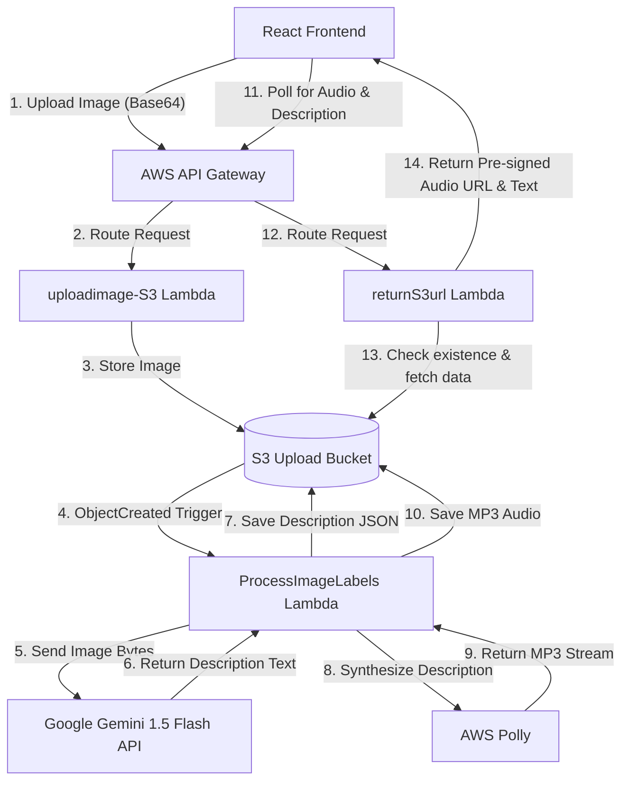

AWS_VOICE_GENERATOR: AI-Powered Image-to-Speech Platform

It is a cloud-native serverless web application that translates visual images into natural-language descriptions and synthesizes them into spoken audio. Designed with accessibility in mind, the platform allows users to upload images, view real-time visual descriptions generated by generative AI, and play back high-quality speech narration.

 System Architecture



Core Features

   -Secure Session Management: Custom glassmorphic authentication system allowing user registration and login with local session persistence in browser localStorage.
  - live Upload Preview & Sanitization: Instant image previews before conversion. Automatically sanitizes filenames by replacing spaces/special characters with underscores and normalizing .jfif images to .jpg extensions.
  - AI Scene Description: Leverages Google Gemini 1.5 Flash (via REST API) to generate detailed, natural-language narrations of uploaded images in 1-2 sentences.
  - High-Quality Text-to-Speech: Integrates AWS Polly (using the Joanna voice) to synthesize natural-sounding speech from description text.
  - Self-Healing Active Polling: A robust polling client that monitors audio generation in the background. It intercepts AWS S3 404 delays, retries safely up to 10 times, and gracefully terminates with precise diagnostics if a backend server error (such as an S3 permission or API key error) is encountered.
  - Personalized Scan Library: Tracks conversion history per user account with the ability to delete items, fetch fresh pre-signed URLs (preventing expired URL errors), and trigger immediate audio playback.

    Technology Stack

- Frontend: React 19.1, HTML5, Vanilla CSS3 (Glassmorphism design system)
- Backend: AWS Lambda (Python 3.12/3.13), AWS API Gateway, AWS S3
- Text-to-Speech: AWS Polly
- AI Vision Model: Google Gemini 1.5 Flash API (via direct REST endpoint)

             Getting Started

  1. Prerequisites
- Node.js (v18+)
- AWS Account
- Google AI Studio API Key (Free tier)

   2. Frontend Installation & Local Setup
 1. Clone the repository:
   ```bash
   git clone https://github.com/YOUR_USERNAME/voxreader-app.git
   cd voxreader-app
   ```
 2. Install npm dependencies:
   ```bash
   npm install
   ```
 3 . Start the React development server on port 3001:
   ```bash
   PORT=3001 npm start
   ```
 4. Access the web app locally at http://localhost:3001.

   3. Backend Lambda Configuration

The application utilizes three AWS Lambda functions, located in the `/aws_lambdas` directory:

- `uploadimage-S3`
  * Purpose: Decodes the uploaded base64 image and saves it to the S3 bucket (`rekognition-upload-bucket-001/uploads_image/`).
  * Configuration: Ensure CORS is enabled on API Gateway.
  * Code: [uploadimage-S3.py](file:///c:/Users/priyanka%20joshi/Desktop/aws-polly-project/aws_lambdas/uploadimage-S3.py)

- `ProcessImageLabelsFunction`
  * Purpose: Triggered by S3 `ObjectCreated` events. It base64-encodes the image, calls Gemini 1.5 Flash for a narration, saves the text, and synthesizes Polly speech.
  * Configuration: Add your Google Gemini API key to the environment variables:
    * Key: `GEMINI_API_KEY`
    * Value: `YOUR_GEMINI_API_KEY_HERE`
  * Code: [ProcessImageLabelsFunction.py](file:///c:/Users/priyanka%20joshi/Desktop/aws-polly-project/aws_lambdas/ProcessImageLabelsFunction.py)

- `returnS3url`
  * Purpose: Checks if the audio exists, reads the JSON description, and returns a pre-signed S3 URL for the MP3.
  * Configuration: Standard proxy API Gateway endpoint.
  * Code: [returnS3url.py](file:///c:/Users/priyanka%20joshi/Desktop/aws-polly-project/aws_lambdas/returnS3url.py)

   Security & IAM Permissions

Ensure the IAM execution roles for the Lambdas have the following minimum policies:

 `ProcessImageLabelsFunction` Role:
```json
{
  "Version": "2012-10-17",
  "Statement": [
    {
      "Effect": "Allow",
      "Action": [
        "s3:GetObject",
        "s3:PutObject"
      ],
      "Resource": "arn:aws:s3:::rekognition-upload-bucket-001/*"
    },
    {
      "Effect": "Allow",
      "Action": "polly:SynthesizeSpeech",
      "Resource": "*"
    }
  ]
}
```
   `returnS3url` Role:
```json
{
  "Version": "2012-10-17",
  "Statement": [
    {
      "Effect": "Allow",
      "Action": "s3:GetObject",
      "Resource": "arn:aws:s3:::rekognition-upload-bucket-001/*"
    }
  ]
}
```
